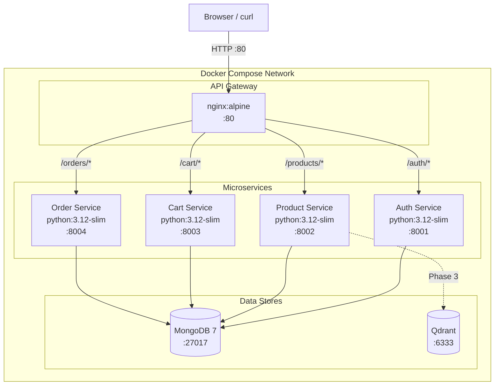

# MVP Architecture (Phase 0)

## Overview

Phase 0 時点での実際のデプロイ構成。`docker compose up` で7コンテナが起動する。

## Container Architecture

## Container Inventory

| Container | Image | Port | Purpose |
|---|---|---|---|
| commerce-gateway | nginx:alpine | 80 | API Gateway, CORS, routing |
| commerce-auth | python:3.12-slim | 8001 | User registration, JWT issuance |
| commerce-product | python:3.12-slim | 8002 | Product catalog, stock check |
| commerce-cart | python:3.12-slim | 8003 | Cart management |
| commerce-order | python:3.12-slim | 8004 | Order processing, mock payment |
| commerce-mongo | mongo:7 | 27017 | Primary data store |
| commerce-qdrant | qdrant/qdrant | 6333, 6334 | Vector DB (Phase 3) |

## Known Limitations (MVP)

- **Shared DB**: All services share one MongoDB instance and database. Cart/Order read product data directly from DB, not via HTTP API
- **No inter-service auth**: Gateway does not enforce authentication; each service handles its own JWT
- **No distributed transactions**: Concurrent orders could cause race conditions on stock decrement
- **No service discovery**: Service addresses are Docker Compose DNS names (hardcoded)
