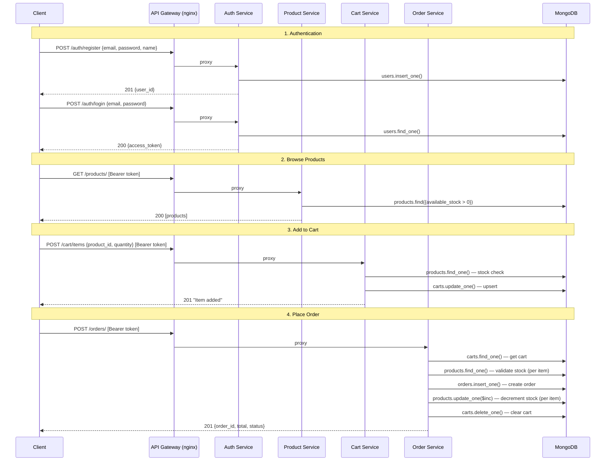

# API Service Flow

## Overview

This document describes the data flow across the 4 microservices
(Auth, Product, Cart, Order) through the nginx API Gateway.

## Request Flow Diagram



## Service Responsibilities

| Service | Reads from | Writes to | Key logic |
|---------|-----------|-----------|-----------|
| Auth | users | users | bcrypt hash, JWT issue |
| Product | products | products | Stock filter (`available_stock > 0`) |
| Cart | products, carts | carts | Stock validation, quantity increment |
| Order | carts, products, orders | products, orders, carts | Stock re-validation, stock decrement, cart clear |

## Data Coupling

All services share a single MongoDB instance (MVP architecture).
Data consistency is maintained through:

1. **Stock validation at cart-add time** — prevents adding out-of-stock items
2. **Stock re-validation at order time** — catches race conditions between cart and order
3. **Atomic stock decrement** — uses MongoDB `$inc` operator (atomic per document)

## Gateway Routing

```
/auth/*      → auth:8001
/products/*  → product:8002
/cart/*      → cart:8003
/orders/*    → order:8004
```

CORS headers are set at the gateway level.
Each service handles its own JWT verification via `Depends(verify_token)`.
